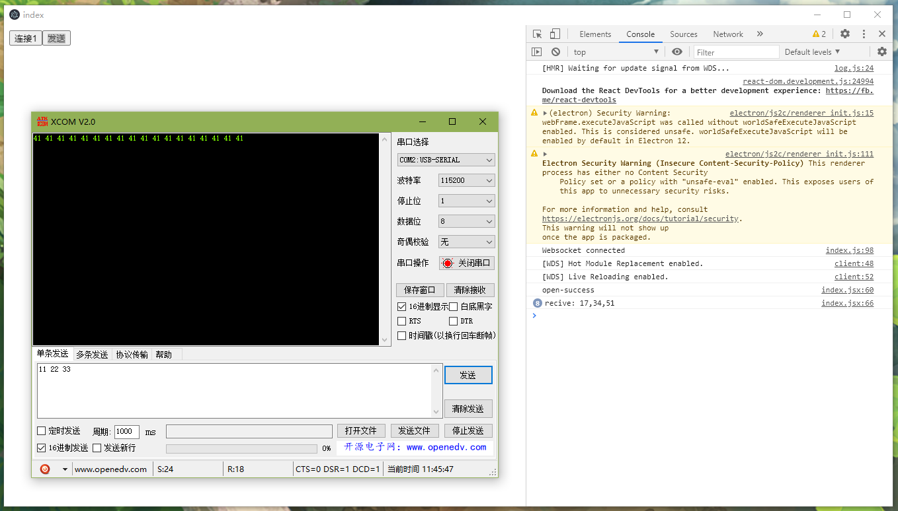

# electron-react-seialport

electron-react环境下操作本地串口的例程



# 使用

```sh
$ npm install
$ npm run start-server
$ npm start
```

启动服务器后使用 **连接** 按钮开启串口，而后使用 **发送** 按钮发送测试数据

# 调试方法

在不使用工程内eletron运行seialport-websocket-server时，因为该工具内的seialport-websocket-server是eletron rebuild过的故而无法直接通过node x.js文件文件启动，可以手动在一个新的seialport-websocket-server使用 `npm run server` 来启动一个本地服务器用于调试。

```sh
// In a new seialport-websocket-server folder
$ npm run server
```

```sh
$ npm run start-web
```

